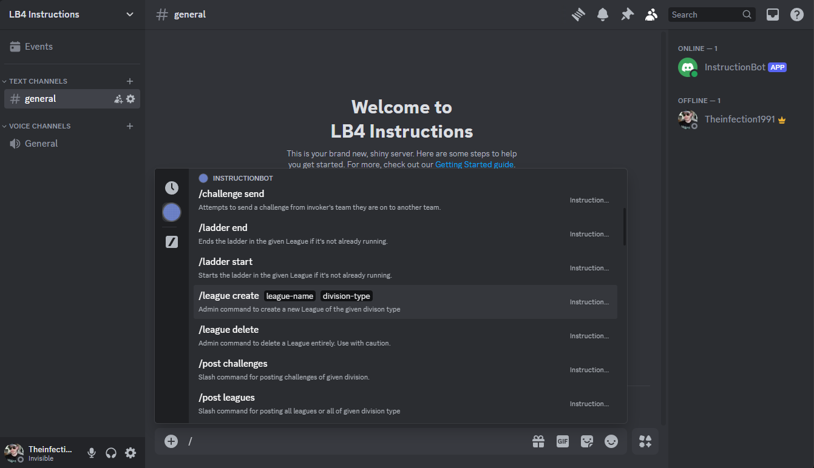
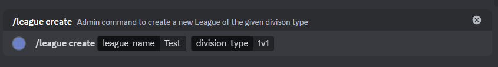
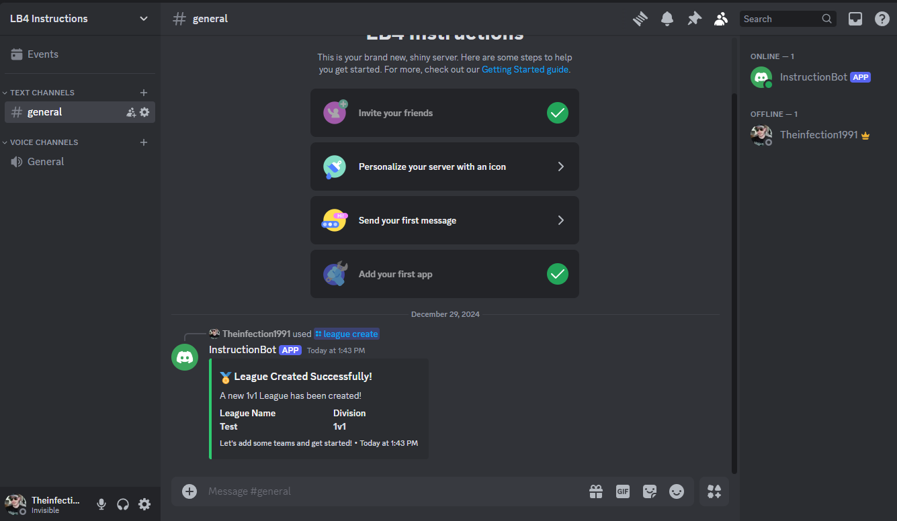
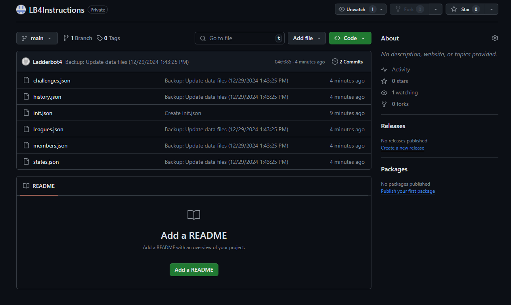

# Flaw's Fight Night Documentation

## Getting Started

**NOTE: I BORROWED THIS STEP-BY-STEP DOCUMENTATION FROM MY OTHER DISCORD BOT (Ladderbot4) SO YOU MAY SEE SOME NAMES AND REFERENCES TO IT IN THE IMAGES AND STEPS FOR NOW, BUT IT IS STILL THE SAME PROCESS JUST FOLLOW ALONG. WILL UPDATE IN THE FUTURE.**

**2ND NOTE: THE GITHUB TOKEN PORTION OF THIS GUIDE WILL VISUALLY LOOK DIFFERENT ON GITHUB'S WEBSITE NOW COMPARED TO PICTURES, BUT IT IS STILL THE SAME PROCESS OF ONLY ALLOWING READ AND WRITE IN THE CONTENTS SECTION ONCE YOU GET TO IT, AND IT WILL TURN ON THE METADATA AUTOMATICALLY LIKE BEFORE AND IT'LL ONLY BE TWO PERMISSIONS ALLOWED.**

This documentation will guide you through the following essential setup steps:
1. **Configuring the Bot**:
   - Setting up the bot's Discord token.
   - Configuring the GitHub Personal Access Token (PAT).
   - Providing the Git HTTPS URL path for backups.
   - Setting the Guild ID to enable slash commands.

2. **Using Commands**:
   - Overview of user commands for interacting with tournaments, teams, matches, and setttings.
   - Explanation of admin commands for advanced configuration and management.

## Configuring The Bot
How to get/set the Discord Token, Git PAT Token, Git Repo HTTPS Url Path, and the Guild ID for SlashCommands:

## How to Setup Discord Developer Portal Correctly (Discord Token and Bot Invite)

Naivgate to the [Discord Developer Portal](https://discord.com/developers) and log in to your Discord account to follow these steps to correctly set up the bot invite link and generate the Discord Token you will need:

---

### Step 1: Create New Application
After logging into the Discord Developer Portal, while in the **Applications** tab click the `New Application` button and enter the name you desire for the new bot.

---

### Step 2: Enable Intents
After entering a name you will be transfered into the General Information tab of the new application. On the left side of the screen click **Bot** (Click three lines if sidebar is not shown automatically).

1. Enable each **Privileged Gateway Intent** for the Bot
2. Be sure to **Save the Changes**.

**HINT** In this Bot tab above the Intents is also where you can change the icon for your bot. This will also change in Discord itself and looks way better than Discord's default avatar.
---

### Step 3: OAuth2 URL Generator
After being sure to save the changes to Intents, now on the left sidebar click the **OAuth2** tab.

Now under **Scopes** tick the box for `bot` and `applications.commands`. After you tick `bot` another box containing more choices will appear below called **Bot Permissions**. Only choose `Administator` from this box, after ticking it every other choice is greyed out anyway.
Your result should look similar to this so far:

Now scroll down and you'll see a dropdown box. Make sure **Guild Install** is selected and the **Generated URL** is now what you can copy and use to invite this bot to your personal Discord server!

---

### Step 4: Invite Bot To Server

Go to the link and it should cause a popup in your Discord. Make sure to have the correct server selected in the drop down to invite the bot to and hit **Continue**.

Another popup will show the Bot is being invited with Adminitrator Rights, hit **Authorize** to continue.

You should now see the Bot in the designated server.

---

### Step 5: Regenerate Discord Token

The last thing I do now is regenerate the Bot Token that we will need to give the bot. Navigate back to the **Bot** tab in the Discord Developer Portal. 
 

Now click **Reset Token** and then click **Yes, do it!" in the following popup. Discord will have you re-enter your password to Reset the Token.

You should now see something similar to what's below. You'll get a long string of numbers, letters and some periods in it. This is the Discord Bot Token and is required for the bot to work. Hold on to this, keep it safe. If you lose it, you'll need to Reset it again.

This completes the Get instructions of the Discord Token, again hold on to it as we will need it once we run the bot.
---

## How To Create Private GitHub Repo And Find Git HTTPS URL Path (Backup Storage)

With my old bot came the ability to backup every .json file (besides credential files as they hold sensitive token information) directly to a GitHub Repo you own or have permission to. Creating a repo is free and easy. I recommend creating a private repo but it's up to you. 

---

### Step 1: Login and Create New Repo
First, navigate to the [GitHub Home Page](https://github.com/). Log in if needed, then click the `+` button and select `New repository`.

Choose a **Repository name** and see if it's available. Again, I recommend making the repository private so click the **Private** tick circle and then click **Create repository**.

---

### Step 2: Find Git HTTPS Url Path

You'll now be moved inside of the repository and where you need to copy down the HTTPS Url it gives you. You will need this for the Git Backup Storage process as well when it asks for the **Git HTTPS URL Path**. You can always come back to this repo and find this link again, it will not change unless you rename the repo.

**IMPORTANT** We must put a `.json` file inside the repo to get things started. I hope to patch this out eventually but for now this must be done for the Backup Storage to work properly. Near where you found the Git HTTPS Url, you'll see a hyper link to create a new file for the repo. Click this.

---

### Step 3: Adding An `init.json` File

1. Type `init.json` where it says Name your file...
2. Click the first Commit Changes button
3. Click the second Commit Chanes button in popup window

You should now see the new `init.json` file in the repository. This will allow the initial push to the repo from the bot when commands are executed.

**HINT** If you marked your Repo as private but want others you trust to see it, invite their GitHub account as a collaborator in the repo's Settings.
---

## How To Generate a GitHub PAT Token (Backup Storage)

To use your GitHub repository as a backup storage system for the database `.json` files, you need to generate a **GitHub PAT Token** that targets the repository of your choice. Follow the instructions below:

---

### Step 1: Access Settings
On the GitHub Desktop site, navigate to your **Settings**.

---

### Step 2: Open Developer Settings
In the left-hand menu, scroll down and select **Developer settings**.

---

### Step 3: Generate a New Fine-Grained Token
Click on **Fine-grained tokens** and then select **Generate new token**.

---

### Step 4: Configure Token Details
1. **Name**: Enter a name for the token. This can be any descriptive name and is not used in the program.
2. **Expiration**: Choose an expiration date. It is recommended to set **"No expiration"** since the token will be used for long-term backups. This is optional and depends on your security needs.
3. **Repository Access**: Under **Repository Access**, select **Only select repositories** and choose the specific repository the token will target.

---

### Step 5: Set Repository Permissions
Under **Repository Permissions**, locate **Contents** and set it to **Read and Write**. This will automatically enable **Metadata** as a required permission. You should now have **2 permissions** selected: **Contents** and **Metadata**.

---

### Step 6: Generate the Token
Click **Generate Token** to finalize the process.

---

### Step 7: Save Your Token
Once the token is generated, **copy the token string** and store it securely. If you lose this token, you will need to regenerate it.

> **Note:** The generated token is required for the program to connect to GitHub and perform backup operations. It must be stored in your program’s configuration file securely.   
---

## Running FlawsFightNight.exe and Initial Bot Setup
Now that we have a **Discord Bot Token**, the **Git PAT Token**, and the **Git HTTPS Url Path** we can fire up **FlawsFightNight** for the first time! Download the latest release of FlawsFightNight [HERE](https://github.com/Theinfection91/FlawsFightNight/releases) or from my Releases section in this Repo and extract the contents of the .zip file into a folder of your choosing. Run the `FlawsFightNight.exe` file and follow these instructions:

### Step 1: Enter Discord Bot Token

Upon running the `.exe` file you'll be welcomed immediately with Windows saying it protected your PC from my Bot. Since this is a small project it is not digitally signed and thus Windows does this. I can assure you there is nothing malicious about this program, but if this warning scares you then you're free to stop the setup now and not use this bot. To bypass this, just click **More Info** and then **Run anyway**

Once you are passed the Security Check you'll be greeted with a Command Prompt looking window, it might not look like much but this is **FlawsFightNight**. You also may or may not have noticed new folders were created in the folder you extracted the `.zip` to. A few different folders and files will be created while the bot finishes this set up process. In the `Credentials` folder you'll find a couple different json files that hold your discord and github token information; These files will not be uploaded to a Git Repo if Backup Storage is setup. 

Now, The first thing the Bot is going to ask you for is the **Discord Bot Token** that we acquired earlier. Copy and paste it into the program now and then press `Enter` on your keyboard.

---

### Step 2: Enter Git PAT Token and HTTPS Path

The second bit of information the bot asks for is the **Git PAT Token** we generated earlier as well. This option can be skipped for now by entering 0 but it is highly recommended to set this up and have backup storage available online in case the bot goes offline for some reason. Copy and paste the token or enter 0 now.

Now it asks for that **Git HTTPS Url Path** that we copied once we made our private repository on GitHub earlier. Copy and paste this into the program now.

You should now see the output say something about `GitBackupManager - No local repo found. Cloning repository...` and `GitBackupManager - Repository cloned successfully.`. If so, the Git PAT Token and Git HTTPS Url Path worked and are now linked together. You will now be asked if you want to copy the newly cloned data as your Database. In most cases, this answer will be Yes (Y). Only in niche situations will you NOT want the cloned data as your Database, like for some reason the local JSON files on the machine are more up to date than the JSON files in the online repo. This would be a rare occurence, but is always possible. To get back to this clone data question process again, **you must delete the 'BackupRepo' folder completely and restart the program itself. Deleting the contents of the folder will not initiate the cloning process again, only by deleting the folder itself will.**

---

### Step 3: Copy and Paste Guild ID From List

Time to locate the Guild ID of the server and give it to the bot. Luckily, I got you on this one. The bot will now dynamically check every server its connected to and give you a list of ID's to choose from. Seeing as how only you invited this one, there should be only one on this list. **CAREFULLY** copy and paste the number. If you hit Ctrl+C twice in fast succession you will close the bot... This is a Windows feature and will look to work code around it one day but for now just be careful. Copy the ID and then paste it right back to the bot and hit `Enter` on your keyboard. This allows for the interactive SlashCommands to immediately show in the given server, instead of waiting up to an hour sometimes for Discord to populate them globally.

---

### Step 4: Checking Commands and Backup Storage

Your window should now look similar to mine, with it saying the bot is logged in as the name you assigned it in the Discord Developer Portal and showing the Guild ID again as well as stating it is `Ready`. You will also see the bot online in your server now when the `.exe` is running. If you entered anything incorrectly, exit the bot and edit the `config.json` file in the Settings folder then save it and reload and check the bot again.

Let's enter our first command and get things started. By pressing `/` on your keyboard in the text input bar of your Discord server the bot is assigned to you should see all of the interactive SlashCommands under a category by the name in which you assigned the bot in the Discord Developer Portal. SlashCommands allow for easy auto-fill and show you the arguments that are required to be passed to the commands before they can be properly executed. If these did not appear then your Guild ID was entered incorrectly. 

To get things going we first need a league in which to register teams into. Let's create a league with `/league create`. Try hitting `/` and start even typing `/crea` and the interactive suggestions even start to limit the result to just `/league create`. You can now just hit `Tab` and auto populate the data into the input bar. You'll notice this format of commands even show the arguments needed for the command. I'll start off by creating a simple 1v1 Test league to make sure everything is working properly.

Beautiful! If you received an error of some sort please try the steps again. If any issues persist then you are more than welcome to message me directly for help.

Since there aren't any errors, this means the backup system should have worked but let's go to the GitHub repo and check for ourselves. If yours looks similar to the image below then you have successfully set up **FlawsFightNight**! I hope you enjoy the program and be sure to check back for any major updates.

---
